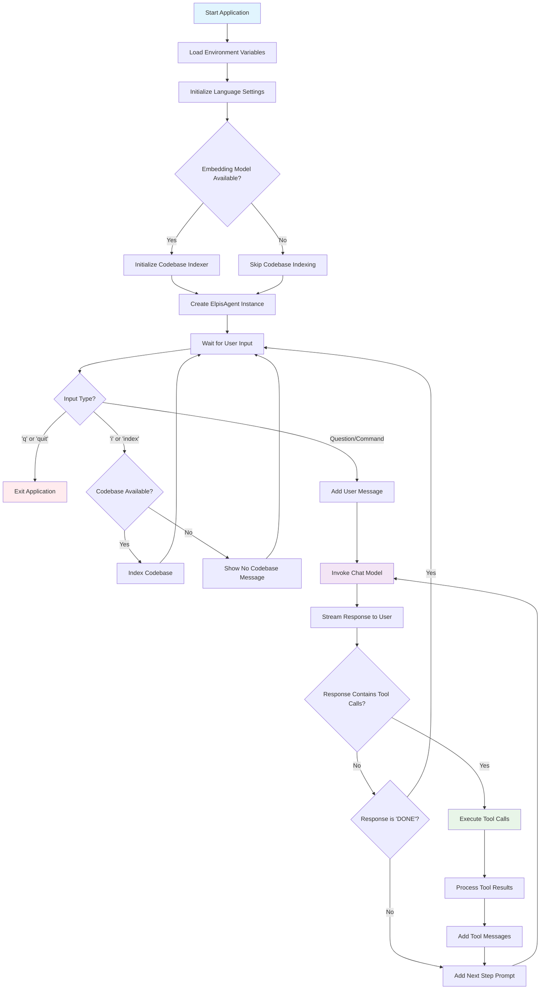

# Elpis Agent

[中文文档](README_zh.md) | English

An ultra-lightweight command-line AI coding assistant tool that mimics Cursor implementation. Elpis is an intelligent code assistant based on LangChain and OpenAI API that helps developers with code writing, file operations, and project management through natural language interaction.

> 🎓 **Learning Project**: This is a minimalist project that is perfect for learning and understanding the working principles of AI coding assistants such as Cursor. Very suitable for developers who want to explore the basic principles of AI driven development tools.

## Features

- 🤖 **Intelligent Conversation**: Natural language interaction based on large language models
- 📁 **File Operations**: Support for reading and writing file contents
- 💻 **Command Execution**: Execute terminal commands (with user confirmation)
- 🔧 **Tool Integration**: Built-in various development tools and features
- 🎯 **Continuous Dialogue**: Support for multi-turn conversations with context preservation
- ⚙️ **Configurable**: Support for custom models, temperature, and other parameters
- 🧠 **Persistent Memory**: SQLite-based conversation history with automatic persistence across sessions
- 🔍 **Codebase Indexing**: Intelligent codebase analysis and semantic search capabilities
- 🌐 **Multi-language Support**: Built-in internationalization (i18n) support
- 🎛️ **Dual Model Architecture**: Separate models for chat and tool operations for optimized performance
- 🏭 **Model Factory**: Flexible model initialization supporting multiple providers and types
- 💾 **Session Management**: Automatic session isolation and memory persistence using LangGraph checkpoints

## Installation

### Quick Start with uvx (Recommended)

You can also run Elpis Agent directly without installation using `uvx`:

```bash
# github
uvx --no-cache --from https://github.com/dragons96/elpis-agent.git elpis --env_file /path/to/.env --lang [en|zh]
# gitee
uvx --no-cache --from uvx --no-cache --from https://gitee.com/dragons96/elpis-agent.git elpis --env_file /path/to/.env --lang [en|zh]
```

This command will:

- Automatically download and run the latest version of elpis-agent
- Use your custom environment file for configuration
- No need for local installation or virtual environment setup

### Requirements

- Python >= 3.11
- OpenAI API Key

### Installation Steps

1. Clone the repository

```bash
git clone <repository-url>
cd elpis-agent
```

2. Create virtual environment

```bash
uv venv
.venv\Scripts\activate
```

3. Install dependencies

```bash
uv pip install -e .
```

4. Configure environment variables

```bash
cp .env.example .env
```

Edit the `.env` file and fill in the necessary configurations:

```env
# Chat Model Configuration
CHAT_BASE_URL=https://api.openai.com/v1
CHAT_API_KEY=your_openai_api_key_here
CHAT_MODEL=gpt-4o-mini
CHAT_MODEL_PROVIDER=openai
CHAT_MODEL_TYPE=chat
CHAT_TEMPERATURE=0.3

# Embedding Model Configuration
EMBEDDING_BASE_URL=https://api.openai.com/v1
EMBEDDING_API_KEY=your_openai_api_key_here
EMBEDDING_MODEL=text-embedding-3-small
EMBEDDING_MODEL_PROVIDER=openai
EMBEDDING_MODEL_TYPE=embedding
EMBEDDING_TEMPERATURE=0.3

# Model Key Prefixes
CHAT_MODEL_KEY_PREFIX=CHAT
EMBEDDING_MODEL_KEY_PREFIX=EMBEDDING

# General Settings
SYSTEM_PROMPT=
MAX_MEMORY_MESSAGES=20
LANG=zh
```

## Usage

### Command Line Interface

After installation, you can start Elpis Agent using:

```bash
elpis
```

Or run directly with Python:

```bash
python -m elpis.main
```

### Interactive Commands

- Type your questions or requests in natural language
- Use `exit` or `quit` to end the session
- The agent can help with:
  - Code writing and debugging
  - File reading and modification
  - Terminal command execution
  - Project structure analysis
  - Development guidance

### Example Usage

```
> Can you help me create a Python function to calculate fibonacci numbers?
> Read the contents of main.py file
> Run the test command to check if everything works
> Help me refactor this code to make it more efficient
```

### Memory Persistence Examples

```bash
# First session
> Hello, my name is Alice and I'm working on a Python project
> What's my name?  # Agent remembers: Alice

# After restarting the application with same session
> Do you remember my name?  # Agent still remembers: Alice
> What project was I working on?  # Agent remembers: Python project
```

**Note**: The agent automatically creates a `.elpis/memory.db` file in your current working directory to store conversation history. Different projects will have separate memory databases.

## Project Structure

```
elpis-agent/
├── src/elpis/
│   ├── __init__.py          # Package initialization
│   ├── main.py              # Main entry point
│   ├── agent.py             # Core agent implementation
│   ├── langgraph_agent.py   # LangGraph-based agent with SQLite memory
│   ├── tools.py             # Tool definitions
│   ├── prompts.py           # Prompt templates
│   ├── constants.py         # Constants and configurations
│   ├── codebase.py          # Codebase indexing and semantic search
│   ├── model_factory.py     # Model factory for flexible initialization
│   └── i18n/                # Internationalization support (contains en.py, zh.py)
├── tests/                   # Test files
├── docs/                    # Documentation
├── .env.example             # Environment variables template
├── pyproject.toml           # Project configuration
├── README.md                # Project documentation (English)
├── README_zh.md             # Project documentation (Chinese)
└── LICENSE                  # License file
```

## Agent Workflow



## Core Components

### ElpisAgent

The core AI agent class responsible for:

- Managing interactions with large language models (supports dual-model architecture)
- Handling tool calls and message flows
- Maintaining conversation context
- Integrating codebase indexing and search capabilities

### CodebaseIndexer

Intelligent codebase analysis component:

- Semantic search across project files
- Support for multiple programming languages
- Automatic gitignore filtering
- Vector-based document indexing
- Configurable text chunking strategies

### Model Factory

Flexible model initialization system:

- Support for multiple model providers (OpenAI, etc.)
- Chat and embedding model types
- Environment-based configuration
- Prefix-based model selection

### Tools

Built-in tools include:

- **read_file**: Read file contents
- **run_terminal_cmd**: Execute terminal commands with user confirmation

### Memory Management

The agent implements persistent memory management using SQLite:

- **SQLite-based Storage**: Conversation history stored in `.elpis/memory.db`
- **Session Isolation**: Different session IDs maintain separate conversation histories
- **Automatic Persistence**: Memory survives application restarts
- **LangGraph Checkpoints**: Built on LangGraph's checkpoint system for reliability
- **Thread Safety**: Concurrent access support with built-in locking mechanisms
- **Auto-initialization**: Database and directory created automatically on first run

### Internationalization (i18n)

Multi-language support:

- Language detection and selection
- Localized user interface messages
- Extensible language pack system

## Configuration

Environment variables can be configured in the `.env` file:

### Chat Model Configuration


| Variable                | ion                      | Default                   |
| ----------------------- | --------------------- | ---------------------------- |
| `CHAT_BASE_URL`       | Chat model API           | `https://apenai.com/v1` |
| `CHAT_API_KEY`        | Chat model API               | -                     |
| `CHAT_MODEL`          | Chat model name                 g1`                |
| `CHAT_MODEL_PROVIDER` | Chat model provr (openlama) | `i`                 |
| `CHAT_MODEL_TYPE`     | Chat model type                     |                     |
| `CHAT_TEMPERATURE`    | Chat model temperature               | `0.3`                       |

 
-
### Embedd ing Model C onfiguration
- 
| Variable                       | Description                        | Default                  |
| --------------------------  -- | ------------------------------------------------------------- |
| `EMBEDDING_BASE_URL`         | Embedding model APIe URL              | p://127.0.0.111434` |
| `EMBEDDING_API_KEY`          | Embedding model API key               |-                   |
| `EMBEDDING_MODEL`           | Embedding model nam                                             |
| `EMBEDDING_MODEL_PROVIDER`  | Embedding model provider (enai, ollama) |ollama`                |

| `EMBEDDING_MODEL_TYPE`     |    Embedding model type                      mbedding`  |
| --`EMBEDDING_TEMPERATU-
RE`    | Embedding model    temperature               | `0.3`                |
    
##---# Model Key Prefixes
   

| Variable                        | Description                            | Defau
| ------------------------------ | ------------------------------------------- |
| `CHAT_MODEL_KEY_PREFIX`      | Prefix for chat model configuration       |

| `EMBEDDING_MODEL_KEY_PREFIX` | Prefix for embedding model configuration | `

### General Settings

| Variable                | Description                                  | Default |
| ----------------------- | -------------------------------------------- | ------- |
| `SYSTEM_PROMPT`       | Custom system prompt                         | -       |
| `LANG`                | Interface language (zh/en)                   | `zh`    |

### Memory Configuration

The SQLite-based memory system automatically manages conversation history:

- **Database Location**: `.elpis/memory.db` in current working directory
- **Session Management**: Each session ID maintains separate conversation threads
- **Automatic Cleanup**: No manual configuration required
- **Persistence**: Conversations survive application restarts
- **Thread Safety**: Built-in support for concurrent access

### Model Configurati
on Prefixes

The model factory supports flexible configuration using prefixes:

- `CHAT_MODEL_KEY_PRE
FIX` - For chat model configuration
- `TOOL_MODEL_KEY_PREFIX` - For tool model configuration
- `EMBEDDING_MODEL_KEY_PREFIX` - For embedding model configuration

Each prefix supports:

- `{PREFIX}_MODEL` - Model name
- `{PREFIX}_MODEL_PROVIDER` - Provider (openai, anthropic, etc.)
- `{PREFIX}_MODEL_TYPE` - Type (chat, embedding)
- `{PREFIX}_API_KEY` - API key
- `{PREFIX}_BASE_URL` - Base URL
- `{PREFIX}_TEMPERATURE` - Temperature setting

## Development

### Setting up Development Environment

1. Clone the repository
2. Create virtual environment: `uv venv`
3. Activate environment: `.venv\Scripts\activate`
4. Install in development mode: `uv pip install -e .`
5. Install development dependencies: `uv pip install pytest black flake8`


### Code Formatting

```bash
black src/
flake8 src/
```

###XBuilding Distribution
X
```Xash
python -m build
```
X
## XODO - Feature Roadmap
X
### 🎯 Core Features

- [X] **Codebase & Indexing**: ✅ Implemented codebase analysis and intelligent indexing
- [X] **Multi-language Support**: ✅ Built-in internationalization (i18n) support
- [X] **Dual Model Architecture**: ✅ Separate models for chat and tool operations
- [X] **Persistent Memory System**: ✅ SQLite-based conversation history with session management
- [ ] **Enhanced Web Search**: Improve web search tools with better result filtering and integration
- [ ] **IDE Plugin Development**: Create plugins for popular IDEs (VS Code, IntelliJ, etc.)

### 🔧 Additional Features

- [ ] **Code Review Assistant**: Automated code review and suggestion system
- [ ] **Project Template Generator**: Generate project templates based on requirements
- [ ] **Integration with Git**: Git operations and workflow assistance
- [ ] **Performance Monitoring**: Track and optimize agent performance
- [ ] **Custom Tool Development**: Framework for creating custom tools
- [ ] **Advanced Codebase Features**: Code refactoring suggestions, dependency analysis
- [ ] **Multi-Provider Support**: Extend model factory to support more AI providers

### 📚 Documentation & Community

- [ ] **Comprehensive Documentation**: Detailed API documentation and tutorials
- [ ] **Example Projects**: Sample projects demonstrating various use cases
- [ ] **Community Contributions**: Guidelines and tools for community contributions
- [ ] **Codebase Indexing Guide**: Documentation for advanced codebase features

Contributions are welcome! Please feel free to submit issues and pull requests.

## License

This project is licensed under the MIT License - see the [LICENSE](LICENSE) file for details.

## Contributing

We welcome contributions! Please feel free to submit a Pull Request. For major changes, please open an issue first to discuss what you would like to change.

## Author

Developed with ❤️ by the Elpis team.

---

**Note**: This project is inspired by Cursor and aims to provide similar functionality in a command-line interface with extensible tool integration.
