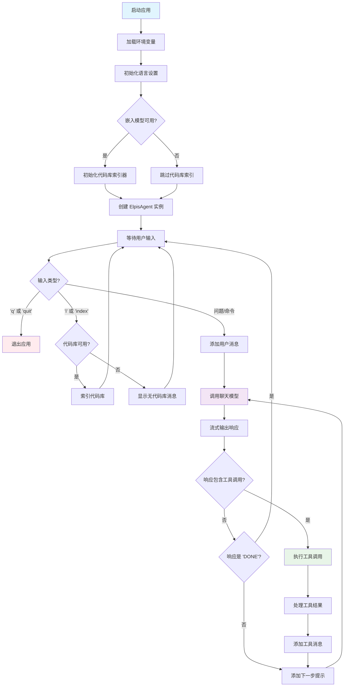

# Elpis Agent

一个超轻量级的模仿 Cursor 实现的命令行 AI 编码助手工具。Elpis 是一个基于 LangChain 和 OpenAI API 的智能代码助手，能够通过自然语言交互帮助开发者进行代码编写、文件操作和项目管理。

> 🎓 **学习项目**: 这是一个极简项目，非常适合学习和理解 Cursor 等 AI 编码助手的工作原理而。非常适合想要探索 AI 驱动开发工具基础原理的开发者。

## 功能特性

- 🤖 **智能对话**: 基于大语言模型的自然语言交互
- 📁 **文件操作**: 支持读取、写入文件内容
- 💻 **命令执行**: 可以执行终端命令（需用户确认）
- 🔧 **工具集成**: 内置多种开发工具和功能
- 🎯 **持续对话**: 支持多轮对话，保持上下文
- ⚙️ **可配置**: 支持自定义模型、温度等参数
- 🔍 **代码库索引**: 智能代码库索引和语义搜索功能
- 🌐 **多语言支持**: 内置国际化(i18n)支持，支持中英文界面
- 🏗️ **双模型架构**: 分离聊天模型和工具模型，优化性能和成本
- 🏭 **模型工厂**: 灵活的模型初始化和配置系统

## 安装

### 快速开始使用 uvx（推荐）

您可以使用 `uvx` 直接运行 Elpis Agent，无需安装：

```bash
uvx --no-cache --from https://github.com/dragons96/elpis-agent.git elpis --env_file /path/to/.env --lang [en|zh]
```

此命令将：uvx --no-cache --from git@github.com:dragons96/elpis-agent.git elpis --env_file D:\Codes\examples\my-agent\.env --lang zhuvx --no-cache --from git@github.com:dragons96/elpis-agent.git elpis --env_file D:\Codes\examples\my-agent\.env --lang zh

- 自动下载并运行最新版本的 elpis-agent
- 使用您的自定义环境配置文件
- 无需本地安装或虚拟环境设置

### 环境要求

- Python >= 3.11
- OpenAI API Key

### 安装步骤

1. 克隆项目

```bash
git clone <repository-url>
cd elpis-agent
```

2. 创建虚拟环境

```bash
uv venv
.venv\Scripts\activate
```

3. 安装依赖

```bash
uv pip install -e .
```

4. 配置环境变量

```bash
cp .env.example .env
```

编辑 `.env` 文件，填入必要的配置：

```env
# 聊天模型配置
CHAT_BASE_URL=https://api.openai.com/v1
CHAT_API_KEY=your_openai_api_key_here
CHAT_MODEL=gpt-4o
CHAT_MODEL_PROVIDER=openai
CHAT_MODEL_TYPE=chat
CHAT_TEMPERATURE=0.3

# 嵌入模型配置（用于代码库索引）
EMBEDDING_BASE_URL=http://localhost:11434
EMBEDDING_MODEL=nomic-embed-text
EMBEDDING_MODEL_PROVIDER=ollama
EMBEDDING_MODEL_TYPE=embedding

# 模型配置前缀
CHAT_MODEL_KEY_PREFIX=CHAT
EMBEDDING_MODEL_KEY_PREFIX=EMBEDDING

# 通用设置
SYSTEM_PROMPT=  # 可选，自定义系统提示词
MAX_MEMORY_MESSAGES=20
LANG=zh  # 界面语言：zh（中文）或 en（英文）

# 已弃用的配置（为了向后兼容）
# OPENAI_API_KEY=your_openai_api_key_here  # 已弃用，请使用 CHAT_API_KEY
# MODEL=gpt-4o  # 已弃用，请使用 CHAT_MODEL
# TEMPERATURE=0.3  # 已弃用，请使用 CHAT_TEMPERATURE
```

## 使用方法

### 基本使用

安装完成后，可以直接使用 `elpis` 命令启动：

```bash
elpis
```

或者使用 Python 模块方式：

```bash
python -m elpis.main
```

### 指定配置文件

```bash
elpis --env_file /path/to/your/.env
```

### 交互示例

```
[You]: 帮我创建一个 Python 函数来计算斐波那契数列
[Elpis]: 我来为您创建一个计算斐波那契数列的函数...

[You]: 读取当前目录下的 main.py 文件
[Elpis]: 正在读取文件内容...

[You]: q  # 输入 'q' 或 'quit' 退出
```

## 项目结构

```
src/elpis/
├── __init__.py          # 包初始化
├── main.py              # 主入口文件
├── agent.py             # 核心 Agent 类
├── tools.py             # 工具函数集合
├── prompts.py           # 提示词模板
├── constants.py         # 常量和配置
├── codebase.py          # 代码库索引和语义搜索
├── model_factory.py     # 模型工厂，用于灵活初始化
└── i18n/                # 国际化支持 (包含 en.py, zh.py)
```

## Agent 工作流程



## 核心组件

### ElpisAgent

核心的 AI 代理类，负责：

- 管理与大语言模型的交互（支持双模型架构）
- 处理工具调用和消息流
- 维护对话上下文
- 集成代码库索引和搜索功能

### CodebaseIndexer

代码库索引器，提供：

- 智能代码库扫描和索引
- 基于嵌入的语义搜索
- 支持多种编程语言
- 自动忽略 .gitignore 文件中的内容

### Model Factory

模型工厂系统，支持：

- 灵活的模型配置和初始化
- 多提供商支持（OpenAI、Ollama等）
- 基于前缀的配置系统
- 聊天模型和嵌入模型的分离管理

### 国际化 (i18n)

多语言支持系统：

- 支持中文和英文界面
- 动态语言切换
- 可扩展的语言包系统

### 内置工具

- **read_file**: 读取文件内容，支持指定行范围
- **run_terminal_cmd**: 执行终端命令（需用户确认）
- 更多工具持续开发中...

## 开发

### 开发环境设置

```bash
# 安装开发依赖
uv pip install -e ".[dev]"

# 代码格式化
black src/

# 代码检查
flake8 src/
mypy src/

# 运行测试
pytest
```

### 添加新工具

在 `tools.py` 中使用 `@tool` 装饰器定义新工具：

```python
from langchain_core.tools import tool

@tool
def your_new_tool(param: str) -> str:
    """工具描述"""
    # 工具实现
    return result
```

## 配置说明

### 聊天模型配置

| 环境变量                | 说明              | 默认值     | 必需 |
| ----------------------- | ----------------- | ---------- | ---- |
| `CHAT_BASE_URL`       | 聊天模型 API 端点 | -          | ❌   |
| `CHAT_API_KEY`        | 聊天模型 API 密钥 | -          | ✅   |
| `CHAT_MODEL`          | 聊天模型名称      | `gpt-4o` | ❌   |
| `CHAT_MODEL_PROVIDER` | 聊天模型提供商    | `openai` | ❌   |
| `CHAT_MODEL_TYPE`     | 聊天模型类型      | `chat`   | ❌   |
| `CHAT_TEMPERATURE`    | 聊天模型温度      | `0.3`    | ❌   |

### 嵌入模型配置

| 环境变量                     | 说明              | 默认值                     | 必需 |
| ---------------------------- | ----------------- | -------------------------- | ---- |
| `EMBEDDING_BASE_URL`       | 嵌入模型 API 端点 | `http://localhost:11434` | ❌   |
| `EMBEDDING_MODEL`          | 嵌入模型名称      | `nomic-embed-text`       | ❌   |
| `EMBEDDING_MODEL_PROVIDER` | 嵌入模型提供商    | `ollama`                 | ❌   |
| `EMBEDDING_MODEL_TYPE`     | 嵌入模型类型      | `embedding`              | ❌   |

### 模型密钥前缀

| 环境变量                       | 说明             | 默认值        | 必需 |
| ------------------------------ | ---------------- | ------------- | ---- |
| `CHAT_MODEL_KEY_PREFIX`      | 聊天模型配置前缀 | `CHAT`      | ❌   |
| `EMBEDDING_MODEL_KEY_PREFIX` | 嵌入模型配置前缀 | `EMBEDDING` | ❌   |

### 通用设置

| 环境变量                | 说明             | 默认值 | 必需 |
| ----------------------- | ---------------- | ------ | ---- |
| `SYSTEM_PROMPT`       | 自定义系统提示词 | -      | ❌   |
| `MAX_MEMORY_MESSAGES` | 最大记忆消息数   | `20` | ❌   |
| `LANG`                | 界面语言         | `zh` | ❌   |

## 🚧 TODO 功能规划

以下是计划中的功能特性，将在后续版本中逐步实现：

### 📚 代码库与索引功能

- [X] **代码库分析**: ✅ 自动分析项目结构和依赖关系
- [X] **智能索引**: ✅ 建立代码语义索引，支持快速检索
- [ ] **上下文感知**: 基于代码库上下文提供更精准的建议
- [ ] **跨文件引用**: 智能识别和处理跨文件的代码引用关系
- [ ] **高级代码库功能**: 代码依赖图、重构建议、代码质量分析
- [ ] **增量索引**: 支持文件变更的增量索引更新

### 🌐 联网搜索工具完善

- [ ] **多搜索引擎支持**: 集成 Google、Bing、DuckDuckGo 等搜索引擎
- [ ] **技术文档搜索**: 专门针对技术文档和 API 文档的搜索优化
- [ ] **实时信息获取**: 获取最新的技术资讯和解决方案
- [ ] **搜索结果过滤**: 智能过滤和排序搜索结果

### 🧠 消息与操作记忆化

- [ ] **对话历史管理**: 持久化存储对话历史，支持跨会话访问
- [ ] **操作记录**: 记录用户的操作习惯和偏好
- [ ] **智能推荐**: 基于历史记录提供个性化建议
- [ ] **上下文恢复**: 快速恢复之前的工作状态和上下文

### 🔌 IDE 插件开发

- [ ] **VS Code 插件**: 开发官方 VS Code 扩展
- [ ] **JetBrains 插件**: 支持 IntelliJ IDEA、PyCharm 等 JetBrains 系列 IDE
- [ ] **Vim/Neovim 插件**: 为 Vim 用户提供集成支持
- [ ] **实时协作**: 在 IDE 中实现与 Elpis 的无缝协作

### 🎯 其他计划功能

- [X] **多语言支持**: ✅ 内置国际化(i18n)支持，支持中英文界面
- [X] **双模型架构**: ✅ 分离聊天模型和工具模型，优化性能和成本
- [ ] **多提供商支持**: 扩展对更多 AI 提供商的支持
- [ ] **代码审查**: 自动代码审查和质量检查
- [ ] **测试生成**: 智能生成单元测试和集成测试
- [ ] **文档生成**: 自动生成代码文档和 API 文档
- [ ] **代码库索引指南**: 提供代码库索引的最佳实践和使用指南

> 💡 **贡献提示**: 如果您对以上功能感兴趣或有其他建议，欢迎提交 Issue 或 Pull Request！

## 许可证

MIT License - 详见 [LICENSE](LICENSE) 文件

## 贡献

欢迎提交 Issue 和 Pull Request！

## 作者

- **dragons96** - [521274311@qq.com](mailto:521274311@qq.com)

---

*Elpis - 让 AI 成为你的编程伙伴* 🚀
