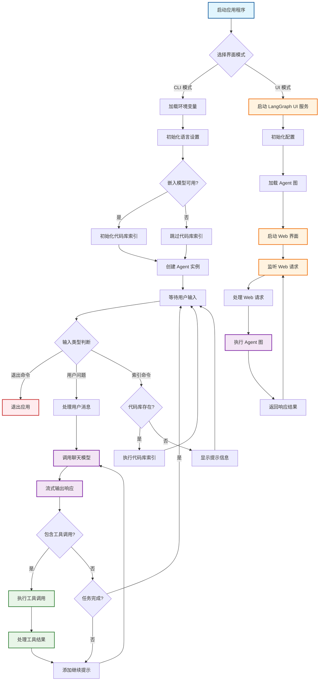

# Elpis Agent

一个超轻量级的模仿 Cursor 实现的命令行 AI 编码助手工具。Elpis 是一个基于 LangChain 和 OpenAI API 的智能代码助手，能够通过自然语言交互帮助开发者进行代码编写、文件操作和项目管理。

> 🎓 **学习项目**: 这是一个极简项目，非常适合学习和理解 Cursor 等 AI 编码助手的工作原理而。非常适合想要探索 AI 驱动开发工具基础原理的开发者。

## 功能特性

- 🤖 **智能对话**: 基于大语言模型的自然语言交互
- 📁 **文件操作**: 支持读取、写入文件内容
- 💻 **命令执行**: 可以执行终端命令
- 🔧 **工具集成**: 内置多种开发工具和功能
- 💾 **持久化记忆**: 基于 SQLite 的对话历史持久化存储
- 🎯 **会话管理**: 支持多会话隔离和跨会话记忆恢复
- ⚙️ **可配置**: 支持自定义模型、温度等参数
- 🔍 **代码库索引**: 智能代码库索引和语义搜索功能
- 🌐 **多语言支持**: 内置国际化(i18n)支持，支持中英文界面
- 🏭 **模型工厂**: 灵活的模型初始化和配置系统
- ✅ **用户确认**: 对危险操作（文件创建/删除、命令执行）进行交互式确认
- 🔌 **MCP 工具集成**: 支持模型上下文协议 (MCP) 服务器，通过外部工具扩展功能
- 🧠 **Mem0 高级记忆**: 基于 Mem0 的智能摘要、关键信息提取和长期记忆管理功能

## 快速开始（推荐）

### 使用 uvx 运行（无需安装）

使用 Elpis Agent 最简单的方式是通过 `uvx`，无需本地安装：

```bash
# 从 PyPI, 使用 --multi-mode 参数开启多行模式, 此时需要额外输入一个回车确认
uvx --from elpis-agent elpis --env_file /path/to/.env --lang [en|zh] [--multi-mode]
# 使用 mem0 持久化上下文
uvx --from elpis-agent[mem0] elpis --env_file /path/to/.env --lang [en|zh] [--multi-mode]

# 从 GitHub
uvx --from https://github.com/dragons96/elpis-agent.git elpis --env_file /path/to/.env --lang [en|zh]
# 从 Gitee
uvx --from https://gitee.com/dragons96/elpis-agent.git elpis --env_file /path/to/.env --lang [en|zh]
```

此命令将：

- 自动下载并运行最新版本的 elpis-agent
- 使用您的自定义环境配置文件
- 无需本地安装或虚拟环境设置
- 始终获得最新功能和错误修复

您也可以使用 `uvx` 直接运行 UI 界面，无需本地安装：

```bash
# 从 PyPI
uvx --from elpis-agent[ui] elpis-ui --env_file /path/to/.env --lang [en|zh]
# 使用 mem0 持久化上下文
uvx --from elpis-agent[ui,mem0] elpis-ui --env_file /path/to/.env --lang [en|zh]

# 从 GitHub
uvx --from https://github.com/dragons96/elpis-agent.git --with langgraph-cli[inmem] elpis-ui --env_file /path/to/.env --lang [en|zh]

# 从 Gitee
uvx --from https://gitee.com/dragons96/elpis-agent.git --with langgraph-cli[inmem] elpis-ui --env_file /path/to/.env --lang [en|zh]
```

这将：

- 自动下载并运行最新版本的 UI 界面
- 使用您的自定义环境配置文件
- 无需本地安装或虚拟环境设置
- 在浏览器中打开 Web 界面进行交互

### 环境要求

- Python >= 3.11
- OpenAI API Key
- 创建包含配置的 `.env` 文件（参见下方配置部分）

## 开发环境设置

### 二次开发使用

如果您想要修改代码或为项目贡献，请按照以下步骤：

1. 克隆项目

```bash
git clone <repository-url>
cd elpis-agent
```

2. 创建虚拟环境

```bash
uv venv
.venv\Scripts\activate
```

3. 安装依赖

```bash
uv pip install -e .
```

4. 配置环境变量

```bash
cp .env.example .env
```

## 配置

创建 `.env` 文件，填入必要的配置：

```env
# 定义一个名为 CHAT 的模型配置
# *_BASE_URL:  API 基础 URL
CHAT_BASE_URL=https://api.openai.com/v1
# *_API_KEY:  API 密钥, ollama 无需填
CHAT_API_KEY=your_openai_api_key_here
# *_MODEL:  模型名称
CHAT_MODEL=gpt-4o-mini
# *_MODEL_PROVIDER:  模型供应商名称, 支持: [openai, ollama]. 其他遵循openai接口规范的模型均可填openai, 通过修改 *_BASE_URL 配置
CHAT_MODEL_PROVIDER=openai
# *_MODEL_TYPE:   模型类型, 支持: [chat, embedding] 默认为: chat
CHAT_MODEL_TYPE=chat
# *_TEMPERATURE:  模型温度，范围在 0 到 1 之间
CHAT_TEMPERATURE=0.3

# 定义一个名为 EMBEDDING 的模型配置
EMBEDDING_BASE_URL=https://api.openai.com/v1
EMBEDDING_API_KEY=your_openai_api_key_here
EMBEDDING_MODEL=text-embedding-3-small
EMBEDDING_MODEL_PROVIDER=openai
EMBEDDING_MODEL_TYPE=embedding

# Agent 的 Chat 模型的名称, 这里使用上面定义的名为 CAHT 的模型
CHAT_MODEL_KEY_PREFIX=CHAT
# Agent 的 Embedding 模型的名称, 这里使用上面定义的名为 EMBEDDING 的模型（可选 - 用于代码库索引）
EMBEDDING_MODEL_KEY_PREFIX=EMBEDDING

# 通用设置
SYSTEM_PROMPT=                    # 自定义系统提示词（可选）

# MCP 配置（可选 - 用于外部工具集成）
MCP_FILE_PATH=mcp.json                   # MCP 服务器配置文件路径

# Mem0 高级记忆配置（可选）
# Mem0 提供智能摘要、关键信息提取和长期记忆管理功能
# 使用 mem0 需要安装时添加组件："uvx --from elpis-agent[mem0] ..."

# 方式一：云端 API 配置（推荐）
# 使用 Mem0 云服务，配置最简单
MEM0_API_KEY=m-********************

# 方式二：自托管模型配置
# 使用自定义模型，提供更多控制和隐私保护
# mem0 的 LLM 模型配置（使用上面定义的模型，如 CHAT）
MEM0_MODEL_KEY_PREFIX=CHAT
# mem0 的 Embedding 模型配置（使用上面定义的模型，如 EMBEDDING）
# 若不设置，则默认使用 mem0 内置的 OpenAI embedding 模型（需要配置 OPENAI_API_KEY）
MEM0_EMBEDDING_KEY_PREFIX=EMBEDDING
# OPENAI_API_KEY=your_openai_api_key_here  # 当 MEM0_EMBEDDING_KEY_PREFIX 未设置时必需
# 向量维度配置（默认：1536，适用于 OpenAI 模型）
# 请根据您的 embedding 模型输出维度调整此值
MEM0_VECTOR_STORE_EMBEDDING_MODEL_DIMS=1536

```

### 配置说明

- **聊天模型**：所有功能都需要配置
- **嵌入模型**：可选，仅用于代码库索引和语义搜索
- **语言设置**：设置 `LANG=en` 使用英文界面，`LANG=zh` 使用中文界面
- **UI 模式**：使用 `elpis --ui` 时，LangGraph UI 将在配置的地址可用
- **MCP 集成**：可选，允许集成外部 MCP 服务器以获得额外工具
- **Mem0 高级记忆**：可选，提供智能记忆管理，支持两种配置模式：
  - **云端模式**：使用 `MEM0_API_KEY` 配置 Mem0 云服务（最简单的设置）
  - **自托管模式**：使用 `MEM0_MODEL_KEY_PREFIX` 和 `MEM0_EMBEDDING_KEY_PREFIX` 配置自定义模型（更多控制权）

### MCP 工具集成

Elpis Agent 支持模型上下文协议 (MCP) 来集成外部工具和服务。使用 MCP 工具的步骤：

1. 在项目根目录创建 `mcp.json` 配置文件：

```json
{
  "mcpServers": {
    "filesystem": {
      "command": "npx",
      "args": ["-y", "@modelcontextprotocol/server-filesystem", "/path/to/allowed/files"]
    },
    "brave-search": {
      "command": "npx",
      "args": ["-y", "@modelcontextprotocol/server-brave-search"]
    }
  }
}
```

2. 设置 `MCP_FILE_PATH` 环境变量（可选，默认为 `./mcp.json`）

3. 安装所需的 MCP 服务器（例如，使用 npm/npx 安装基于 Node.js 的服务器）

4. 启动 Elpis Agent - MCP 工具将自动加载并可用

**可用的 MCP 服务器：**
- `@modelcontextprotocol/server-filesystem`: 文件系统操作
- `@modelcontextprotocol/server-brave-search`: 网络搜索功能
- `@modelcontextprotocol/server-git`: Git 仓库操作
- 以及 MCP 生态系统中的更多服务器

**注意**: MCP 服务器作为独立进程运行，通过 stdio 进行通信。请确保指定的命令和参数在您的系统上是正确的。

## 使用方法

### 命令行界面

安装完成后，可以直接使用 `elpis` 命令启动：

```bash
elpis
```

或者使用 uv 运行：

```bash
uv run elpis
```

### UI 界面

Elpis Agent 还提供了基于 Web 的 UI 界面，方便用户交互：

#### 本地安装运行

安装完成后，可以使用以下命令启动 UI 界面：

```bash
elpis-ui
```

或者使用 uv 运行：

```bash
uv run elpis-ui
```

这将：

- 自动下载并运行最新版本的 UI 界面
- 使用您的自定义环境配置文件
- 无需本地安装或虚拟环境设置
- 在浏览器中打开 Web 界面进行交互

### 指定配置文件

```bash
elpis --env_file /path/to/your/.env
```

### 交互示例

```
[You]: 帮我创建一个 Python 函数来计算斐波那契数列
[Elpis]: 我来为您创建一个计算斐波那契数列的函数...

[You]: 读取当前目录下的 main.py 文件
[Elpis]: 正在读取文件内容...

[You]: q  # 输入 'q' 或 'quit' 退出
```

#### SQLite 记忆化功能演示

```
# 第一次会话
[You]: 我正在开发一个 Web 应用，使用 Flask 框架
[Elpis]: 好的，我了解您正在使用 Flask 开发 Web 应用...

[You]: q  # 退出应用

# 重新启动应用 - 记忆会自动恢复
[You]: 刚才我们讨论的 Flask 应用，现在需要添加数据库支持
[Elpis]: 根据我们之前的讨论，您的 Flask 应用现在需要添加数据库支持...
# Elpis 记住了之前关于 Flask 应用的对话内容
```

## 项目结构

```
elpis-agent/
├── src/elpis/
│   ├── __init__.py          # 包初始化
│   ├── main.py              # CLI 主入口文件
│   ├── langgraph_agent.py   # LangGraph 代理实现（支持 SQLite 记忆化）
│   ├── tools.py             # 工具定义和实现
│   ├── prompts.py           # 提示词模板
│   ├── constants.py         # 常量和配置
│   ├── codebase.py          # 代码库索引和语义搜索
│   ├── factories/           # 工厂模式实现
│   │   ├── __init__.py
│   │   ├── model_factory.py      # 模型工厂，用于灵活初始化
│   │   └── checkpointer_factory.py # 检查点工厂，用于记忆管理
│   ├── i18n/                # 国际化支持
│   │   ├── __init__.py
│   │   ├── en.py            # 英文语言支持
│   │   └── zh.py            # 中文语言支持
│   └── ui/                  # Web UI 组件
│       ├── __init__.py
│       ├── graph.py         # LangGraph UI 集成
│       ├── graph_main.py    # UI 主入口文件
│       └── langgraph.json   # LangGraph 配置
├── tests/                   # 测试文件
├── docs/                    # 文档
├── .env.example             # 环境变量模板
├── pyproject.toml           # 项目配置
├── README.md                # 项目文档（英文）
├── README_zh.md             # 项目文档（中文）
└── LICENSE                  # 许可证文件
```

## Agent 工作流程



## 核心组件

### ElpisAgent

核心的 AI 代理类，负责：

- 处理工具调用和消息流
- 基于 SQLite 的持久化记忆管理
- 会话隔离和跨会话记忆恢复
- 集成代码库索引和搜索功能
- **用户确认系统**: 使用 LangGraph interrupt 功能对危险操作进行交互式确认
  - 自动检测风险操作（文件创建/删除、命令执行）
  - 通过命令行界面进行实时用户交互
  - 优雅处理用户批准/拒绝决策
  - 显示详细操作信息以便用户做出明智决策

#### 记忆化管理

使用 LangGraph 的 SQLite checkpoint 功能实现持久化记忆存储：

- **持久化存储**: 对话历史自动保存到 SQLite 数据库
- **会话隔离**: 每个会话拥有独立的记忆空间
- **自动恢复**: 重启应用后自动恢复之前的对话上下文
- **线程安全**: 支持并发访问和多线程环境
- **自动管理**: 无需手动配置，开箱即用

### CodebaseIndexer

代码库索引器，提供：

- 智能代码库扫描和索引
- 基于嵌入的语义搜索
- 支持多种编程语言
- 自动忽略 .gitignore 文件中的内容

### Model Factory

模型工厂系统，支持：

- 灵活的模型配置和初始化
- 多提供商支持（OpenAI、Ollama等）
- 基于前缀的配置系统
- 聊天模型和嵌入模型的分离管理

### 国际化 (i18n)

多语言支持系统：

- 支持中文和英文界面
- 动态语言切换
- 可扩展的语言包系统

### 内置工具

- **read_file**: 读取文件内容，支持指定行范围
- **run_terminal_cmd**: 执行终端命令（需用户确认）

**MCP 工具**: 当配置了 MCP 服务器时，会自动提供额外的工具：
- **文件系统操作**: 高级文件和目录管理功能
- **网络搜索**: 实时网络搜索能力
- **Git 操作**: 仓库管理和版本控制
- **更多功能**: 通过 MCP 生态系统可扩展

## 开发

### 开发环境设置

```bash
# 安装开发依赖
uv pip install -e ".[dev]"

# 代码格式化
black src/

# 代码检查
flake8 src/
mypy src/

```

### 添加新工具

在 `tools.py` 中使用 `@tool` 装饰器定义新工具：

```python
from langchain_core.tools import tool

@tool
def your_new_tool(param: str) -> str:
    """工具描述"""
    # 工具实现
    return result
```

## 配置说明

### 聊天模型配置

| 环境变量                | 说明              | 默认值     | 必需 |
| ----------------------- | ----------------- | ---------- | ---- |
| `CHAT_BASE_URL`       | 聊天模型 API 端点 | -          | ❌   |
| `CHAT_API_KEY`        | 聊天模型 API 密钥 | -          | ✅   |
| `CHAT_MODEL`          | 聊天模型名称      | `gpt-4o` | ❌   |
| `CHAT_MODEL_PROVIDER` | 聊天模型提供商    | `openai` | ❌   |
| `CHAT_MODEL_TYPE`     | 聊天模型类型      | `chat`   | ❌   |
| `CHAT_TEMPERATURE`    | 聊天模型温度      | `0.3`    | ❌   |

### 嵌入模型配置

| 环境变量                     | 说明              | 默认值                     | 必需 |
| ---------------------------- | ----------------- | -------------------------- | ---- |
| `EMBEDDING_BASE_URL`       | 嵌入模型 API 端点 | `http://localhost:11434` | ❌   |
| `EMBEDDING_MODEL`          | 嵌入模型名称      | `nomic-embed-text`       | ❌   |
| `EMBEDDING_MODEL_PROVIDER` | 嵌入模型提供商    | `ollama`                 | ❌   |
| `EMBEDDING_MODEL_TYPE`     | 嵌入模型类型      | `embedding`              | ❌   |

### 模型密钥前缀

| 环境变量                       | 说明             | 默认值        | 必需 |
| ------------------------------ | ---------------- | ------------- | ---- |
| `CHAT_MODEL_KEY_PREFIX`      | 聊天模型配置前缀 | `CHAT`      | ❌   |
| `EMBEDDING_MODEL_KEY_PREFIX` | 嵌入模型配置前缀 | `EMBEDDING` | ❌   |

### 通用设置

| 环境变量          | 说明             | 默认值 | 必需 |
| ----------------- | ---------------- | ------ | ---- |
| `SYSTEM_PROMPT` | 自定义系统提示词 | -      | ❌   |
| `LANG`          | 界面语言         | `zh` | ❌   |

### SQLite 记忆化功能

Elpis Agent 使用 LangGraph 的 SQLite checkpoint 功能实现持久化记忆存储：

- **数据库位置**: `.elpis/memory.db`（在当前工作目录下自动创建）
- **会话管理**: 每个会话使用唯一的 `session_id` 进行隔离
- **自动清理**: 数据库会自动管理存储空间，无需手动清理
- **持久性**: 对话历史在应用重启后自动恢复
- **线程安全**: 支持并发访问，适用于多线程环境

> 💡 **提示**: 无需额外配置，SQLite 记忆化功能开箱即用。如需自定义数据库位置，可以修改 `langgraph_agent.py` 中的路径设置。

### 用户确认配置

智能体包含一个安全系统，对潜在危险操作要求用户确认：

- **危险操作**: 文件创建、删除、编辑和命令执行
- **交互式确认**: 通过命令行界面进行实时提示
- **可定制**: 可配置包含/排除特定操作
- **优雅处理**: 对拒绝操作进行适当的取消和错误处理

```python
# 自定义危险操作列表
agent.DANGEROUS_TOOLS = {
    'create_file',
    'delete_file', 
    'edit_file',
    'run_terminal_cmd'
}

# 禁用特定工具的确认
agent.DANGEROUS_TOOLS.discard('create_file')

# 禁用所有确认
agent.DANGEROUS_TOOLS = set()
```

## 🚧 TODO 功能规划

以下是计划中的功能特性，将在后续版本中逐步实现：

### 📚 代码库与索引功能

- [X] **代码库分析**: ✅ 自动分析项目结构和依赖关系
- [X] **智能索引**: ✅ 建立代码语义索引，支持快速检索
- [X] **多语言支持**: ✅ 内置国际化(i18n)支持，支持中英文界面
- [ ] **上下文感知**: 基于代码库上下文提供更精准的建议
- [ ] **跨文件引用**: 智能识别和处理跨文件的代码引用关系
- [ ] **高级代码库功能**: 代码依赖图、重构建议、代码质量分析
- [ ] **增量索引**: 支持文件变更的增量索引更新

### 🌐 联网搜索工具完善

- [ ] **多搜索引擎支持**: 集成 Google、Bing、DuckDuckGo 等搜索引擎
- [ ] **技术文档搜索**: 专门针对技术文档和 API 文档的搜索优化
- [ ] **实时信息获取**: 获取最新的技术资讯和解决方案
- [ ] **搜索结果过滤**: 智能过滤和排序搜索结果

### 🧠 消息与操作记忆化

- [X] **持久化记忆系统**: ✅ 基于 SQLite 的对话历史存储和会话管理
- [ ] **操作记录**: 记录用户的操作习惯和偏好
- [ ] **智能推荐**: 基于历史记录提供个性化建议
- [X] **高级记忆功能**: 智能摘要、关键信息提取、长期记忆管理

### 🔌 IDE 插件开发

- [ ] **VS Code 插件**: 开发官方 VS Code 扩展
- [ ] **JetBrains 插件**: 支持 IntelliJ IDEA、PyCharm 等 JetBrains 系列 IDE
- [ ] **Vim/Neovim 插件**: 为 Vim 用户提供集成支持
- [ ] **实时协作**: 在 IDE 中实现与 Elpis 的无缝协作

### 🎯 其他计划功能

- [ ] **代码审查**: 自动代码审查和质量检查
- [ ] **测试生成**: 智能生成单元测试和集成测试
- [ ] **文档生成**: 自动生成代码文档和 API 文档
- [ ] **代码库索引指南**: 提供代码库索引的最佳实践和使用指南

> 💡 **贡献提示**: 如果您对以上功能感兴趣或有其他建议，欢迎提交 Issue 或 Pull Request！

## 许可证

MIT License - 详见 [LICENSE](LICENSE) 文件

## 贡献

欢迎提交 Issue 和 Pull Request！

## 作者

- **dragons96** - [521274311@qq.com](mailto:521274311@qq.com)

---

*Elpis - 让 AI 成为你的编程伙伴* 🚀
